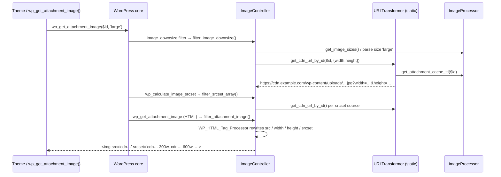

# Architecture Overview

Bunnify Frontend is a lightweight, **frontend-only** BunnyCDN image-URL rewriter for WordPress.
It does not upload, purge, or store anything on Bunny — it rewrites the URLs WordPress emits so
that `` `src`/`srcset`, downsized sources, galleries, and widget images point at your Bunny
pull zone, optionally with on-the-fly resize query args (`?width=…&height=…`).

- **Runtime:** PHP 8.2+, WordPress 6.3+.
- **Config:** a single option, `bunnify_hostname` (empty ⇒ plugin is inert).
- **Extension surface:** ~20 `bunnify_*` filters/actions — see [HOOKS.md](HOOKS.md).

This page describes the *shipped* plugin under `bunnify-frontend/` (the repo root holds docs and the
dev toolchain, which are **not** shipped). All file references below are relative to the plugin
subdirectory `bunnify-frontend/`.

---

## 1. Bootstrap

The plugin uses a small in-house mini-MVC framework under `src/php/Base`. Boot is a three-step
handoff: entry file → `Base\Main\Application` → controllers on `plugins_loaded`.

```
wp-settings.php loads the plugin
        │
        ▼
bunnify-frontend.php  (entry file)
  1. require build-tools/vendor/autoload.php   (PSR-4 runtime autoloader)
  2. guard: bail if BunnifyFrontend\APP_NAME already defined
  3. define APP_NAME = basename(__DIR__)
  4. new Base\Main\Application( APP_NAME, __DIR__, [ …6 controllers… ] )
        │
        ▼
Base\Main\Application::__construct()
  • load_config()  → new Base\Library\Config( $this ); ->autoload()
  • add_action( 'plugins_loaded', [ $this, 'setup_controllers' ] )
        │
        ▼  (on plugins_loaded)
Application::setup_controllers()   — for each controller:
  • base_pre_controller_set_instances   (filter)
  • set_services_for_controller()       — trait-driven service injection
  • base_post_controller_set_instances  (filter)
  • $controller->set_config_instance( $config )
  • base_pre_controller_set_up          (filter)
  • $controller->set_up()               ← registers this controller's WP hooks
  • base_post_controller_set_up         (filter)
```

Key facts:

- The controller list is declared **in the entry file** (`bunnify-frontend.php:47-57`) and passed to
  `Application`. Order is: `CDNController`, `WPResourceHintsController`, `ContentController`,
  `ImageController`, `SettingsController`.
- Every controller extends `Base\Main\Controller` (`src/php/Base/Main/Controller.php`) and must
  implement `set_up()` — the single place a controller registers its WordPress hooks
  (`Controller.php:32`, `abstract public function set_up()`).
- **Trait-driven service injection.** `Application::set_services_for_controller()`
  (`src/php/Base/Main/Application.php:124`) inspects the controller's traits — collected recursively
  across parent classes and traits-of-traits by `get_traits_recursive()` — and lazily constructs
  and injects a shared `Route`, `REST`, or `AdminAjax` instance only for controllers that use the
  matching trait (`RouteTrait` / `RESTTrait` / `AdminAjaxTrait`). None of Bunnify's controllers use
  those traits today, so no services are injected — but the mechanism is the framework's substitute
  for a DI container.
- The autoloader is loaded from `build-tools/vendor/autoload.php` (a minimal PSR-4 map that ships in
  the zip), guarded by the `APP_NAME` constant so a double-load (e.g. plugin + bundled dependency)
  is a no-op.

---

## 2. Directory layout

```
bunnify-frontend/                     ← installable plugin (ships to WordPress.org)
├── bunnify-frontend.php              ← entry file: autoload + boot Application
├── readme.txt                        ← wp.org readme (source of truth for version)
├── uninstall.php                     ← deletes bunnify_* options
├── build-tools/vendor/               ← runtime PSR-4 autoloader (ships)
└── src/php/
    ├── Base/                         ← mini-MVC framework (Main, Library, Traits, Model)
    │   ├── Main/{Application,Controller,View}.php
    │   ├── Library/{Config,Route,REST,AdminAjax}.php
    │   └── Traits/{CachingTrait,DebugTrait,RouteTrait,RESTTrait,…}.php
    ├── Controller/                   ← the 6 controllers (WP hook wiring lives here)
    ├── Library/{URLTransformer,ImageProcessor}.php   ← core logic
    ├── Model/PostType/Attachment.php ← attachment post-type constant
    └── Function/AutoLoad.php
```

`src/php/Base` is deliberately excluded from PHPCS/PHPStan today (it is treated as vendored,
hand-maintained framework code) — this is tracked as debt, see §8.

---

## 3. Controllers

Controllers are plain objects. Each owns a slice of WordPress' rendering pipeline and registers its
hooks in `set_up()`.

| Controller | File | Responsibility | Registers |
|---|---|---|---|
| **CDNController** | `Controller/CDNController.php` | Public entry point for direct URL rewriting; exposes the `bunnify_url` filter. Resolves an attachment ID first (to preserve the *original* filename) and falls back to `URLTransformer::transform_url()`. | `bunnify_url` |
| **ImageController** | `Controller/ImageController.php` | The core image pipeline: single-image downsize, attachment `src` arrays, final `` HTML, and responsive `srcset`/`sizes`. Handles registered sizes, `[w,h]` arrays, and custom `16:9-768`-style aspect-ratio sizes. | `image_downsize`, `wp_get_attachment_image_src`, `wp_get_attachment_image`, `wp_calculate_image_srcset_meta`, `wp_calculate_image_srcset`, `wp_calculate_image_sizes` |
| **ContentController** | `Controller/ContentController.php` | Post-render HTML rewriting for content that isn't produced by the attachment functions: `the_content`, blocks, galleries, and text/media widgets. Uses `WP_HTML_Tag_Processor` and a heuristic (`is_attachment_image()`) to skip images already handled by `ImageController`. | `bunnify_content`, `the_content`, `widget_text`, `get_post_galleries`, `widget_media_image_instance`, `render_block`, `render_block_core/gallery` |
| **WPResourceHintsController** | `Controller/WPResourceHintsController.php` | Adds a `preconnect` resource hint for the Bunny hostname (and strips a duplicate `dns-prefetch`). Skips the hint when the CDN host equals the site host (local/staging/misconfig). | `wp_resource_hints` |
| **SettingsController** | `Controller/SettingsController.php` | Media → **BunnyCDN** admin page. Registers `bunnify_hostname`, `bunnify_local_dev_mode`, and the debug toggles via the Settings API; exposes static helpers `is_local_dev_mode_enabled()` and `is_debug_enabled_for_category()`. | `admin_menu`, `admin_init` |

### ImageController vs ContentController — the split

The two rewriters cover **disjoint** rendering paths and coordinate via a heuristic:

- `ImageController` intercepts WordPress' *structured* attachment APIs (`wp_get_attachment_image*`,
  `image_downsize`, `wp_calculate_image_srcset`). It knows the attachment ID and requested size, so
  it can compute exact dimensions and aspect ratios.
- `ContentController` rewrites *already-rendered HTML strings* (`the_content`, blocks, widgets) where
  there is no attachment context — it parses each `` and resolves the ID from the `src` URL. Its
  `is_attachment_image()` check (`ContentController.php:355`) skips images bearing `wp-post-image` (a
  post thumbnail already handled by `ImageController`) to avoid double-processing.

---

## 4. Libraries

Two static-heavy libraries under `src/php/Library` hold the logic the controllers call. Both use
`declare(strict_types=1)`.

### URLTransformer — the CDN URL builder

`URLTransformer` (`Library/URLTransformer.php`) turns a local upload URL (or an attachment ID) into a
Bunny URL. Responsibilities:

- **Instance path** — `transform_url( $image_url, $args, $scheme )`: validates the URL, confirms it is
  a local upload (`is_local_upload_url()`), then builds `https://{hostname}{path}?{query}` via
  `build_cdn_url()` / `build_query_string()`. Applies the `bunnify_skip_for_url`,
  `bunnify_pre_image_url`, `bunnify_pre_args`, and `bunnify_post_image_url` filters. The constructor
  validates and sanitizes the hostname and throws `InvalidArgumentException` if it is empty/invalid.
- **Static path** — `get_cdn_url_by_id( $attachment_id, $args, $scheme )`: the workhorse the image
  and content pipelines call. It resolves the **true original** URL (stripping `-scaled`, avoiding
  WordPress' dimension-suffixed derivatives) via `get_true_original_url()` and builds the CDN URL from
  that path so Bunny always pulls the full-resolution original and resizes on the fly. Backed by a
  lazily-initialised static singleton (`init_static_cdn()`, `URLTransformer.php:444`).
- **Query args** — `build_query_string()` maps `width`/`height`/`crop` to Bunny's params and passes
  through any additional scalar transform args (e.g. `quality`, `format`).
- **Guards** — `validate_image_url()` (extension allow-list, not-already-CDN), `is_cdn_url()`
  (hostname match or presence of CDN query params), and `image_exists_locally()` (used by local-dev
  mode to bypass rewriting for files present on disk).

### ImageProcessor — attachment lookup, dimensions, caching

`ImageProcessor` (`Library/ImageProcessor.php`) is the read/parse/cache half:

- `get_attachment_id_from_url()` — reverse-maps a URL to an attachment ID, with fallbacks that strip
  `-1024x684` dimension suffixes and try the `-scaled` variant; results cached (see §6).
- `parse_dimensions_from_filename()` — extracts `WxH` from a derivative filename.
- `get_image_sizes()` — collects registered WordPress sizes (core + theme/plugin) with static memo.
- `attachment_url_to_postid()`, `get_cached_original_url()`, `get_attachment_cache_ttl()` — the
  cached DB-lookup helpers and the smart-TTL policy that the rest of the plugin shares.

**The split:** `URLTransformer` *writes* CDN URLs; `ImageProcessor` *reads and resolves* attachment
data (ID ↔ URL, dimensions, registered sizes) and owns the TTL policy. `URLTransformer` delegates its
attachment lookups and TTLs back to `ImageProcessor` (e.g. `URLTransformer::get_attachment_id_from_url()`
and `get_true_original_url()` both call into `ImageProcessor`), keeping URL construction and WordPress
data access on opposite sides of the boundary.

---

## 5. How a request flows

Example: a template calls `wp_get_attachment_image( $id, 'large' )`.



Text summary:

1. **`image_downsize`** → `ImageController::filter_image_downsize()` resolves the requested size to
   width/height (registered size, `[w,h]` array, or `16:9-768` custom parse), then calls
   `URLTransformer::get_cdn_url_by_id()` and returns `[cdn_url, width, height, false]`.
2. **`wp_calculate_image_srcset`** → `filter_srcset_array()` rewrites each responsive source to a CDN
   URL, computing per-descriptor dimensions from the original's aspect ratio.
3. **`wp_get_attachment_image`** → `filter_attachment_image()` is the final HTML pass: it parses the
   emitted `` with `WP_HTML_Tag_Processor` and rewrites `src`, `width`, `height`, and `srcset`
   (or generates a srcset/sizes if none exist).
4. Content not produced by these functions (inline `` in `the_content`, blocks, galleries,
   widgets) is handled separately by **`ContentController`** on `the_content`/`render_block`/etc.
5. Every path bottoms out at `URLTransformer::get_cdn_url_by_id()` → true-original resolution →
   `https://{bunnify_hostname}{path}?{args}`.

Short-circuits at each stage: admin context (unless opted in), `BUNNIFY_DISABLE`, the
`bunnify_skip_for_url` / `bunnify_override_*` filters, already-CDN URLs, and **local-dev mode** (file
exists on disk ⇒ return the original untouched).

---

## 6. Configuration

- **`bunnify_hostname`** — the only functional switch. Empty ⇒ every CDN-init guard returns early and
  the plugin passes URLs through untouched. Set on **Media → BunnyCDN** (e.g. `cdn.example.com`).
- **`bunnify_local_dev_mode`** — when on, rewriting is bypassed for any image that exists on the local
  filesystem (`URLTransformer::image_exists_locally()`), so local originals render while
  CDN-only assets still rewrite. Overridable per-request via the `bunnify_local_dev_mode_check` filter.
- **`BUNNIFY_DISABLE`** (constant) — hard kill switch checked in `transform_url()` / `cdn_url()`.
- **Debug logging** — `bunnify_debug_enabled` plus per-category toggles (`bunnify_debug_url_transformation`,
  `…_image_processing`, `…_srcset_generation`, `…_content_filtering`, `…_local_dev_mode`, `…_performance`).
  Logs are written to `wp-content/uploads/bunnify-debug.log` and only emitted when a page is loaded with
  `?bunnify_debug=1`. See [LOGGING.md](LOGGING.md).
- **`bunnify_enabled`** — the master switch, read via `SettingsController::is_enabled()` and checked
  in the CDN bootstrap paths (`CdnClientTrait::init_cdn()`, `URLTransformer::init_static_cdn()`) and
  the resource-hints controller. A missing option means **enabled** (installs configured before the
  switch was wired up keep rewriting); only an explicitly saved falsy value disables the plugin. A
  configured `bunnify_hostname` is still required for anything to rewrite.

`uninstall.php` removes all `bunnify_*` options.

---

## 7. Caching strategy

All caching goes through the WordPress object cache in a single group, **`bunnify_frontend`**, so a
persistent backend (Redis/Memcached) makes it durable across requests; without one it is per-request.

Two layers, with **smart, age-based TTLs** (older attachments change less, so they cache longer):

- **`Base\Traits\CachingTrait`** (`src/php/Base/Traits/CachingTrait.php`) — used by the controllers.
  Wraps `wp_cache_*` and caches attachment metadata (`get_cached_attachment_metadata()`), attachment
  URLs, true-original URLs, and filesystem checks. Its TTL ladder
  (`get_attachment_cache_ttl()`, `CachingTrait.php:238`) is 5 min → 1 hour → 1 day → 1 week based on
  attachment age (newer → shorter).
- **`Library\ImageProcessor`** (also `use`s `CachingTrait`) — owns the *lookup* caches:
  URL→ID (`get_attachment_id_from_url`), `attachment_url_to_postid`, and original-URL caches, keyed by
  `md5()` of the URL. Its own `get_attachment_cache_ttl()` uses a longer ladder for these expensive DB
  lookups: 7 days (recent) → 30 → 60 → 120 days (very old / not-found), with a 5-minute floor. Negative
  results are cached as the sentinel string `not_found`.

`URLTransformer::get_true_original_url()` caches the resolved original per attachment
(`bunnify_true_original_url_{id}`) using `ImageProcessor`'s TTL. `clear_attachment_cache()` /
`clear_all_bunnify_caches()` (group flush) exist for invalidation.

---

## 8. Public filter surface

Bunnify's contract with themes and other plugins is its `bunnify_*` hooks — the **only** supported
extension points. The full list with signatures and examples lives in **[HOOKS.md](HOOKS.md)**.
Highlights:

- **`bunnify_url`** — direct URL rewrite entry point (`apply_filters('bunnify_url', $url, $args, $scheme)`).
- **`bunnify_skip_for_url`**, **`bunnify_pre_image_url`**, **`bunnify_pre_args`**,
  **`bunnify_post_image_url`** — the transform pipeline hooks.
- **`bunnify_allow_non_upload_url`** — opt in URLs outside `wp-content/uploads`.
- **`bunnify_local_dev_mode_check`** — override local-dev detection per request.
- **`bunnify_override_image_downsize`**, **`bunnify_replace_attachment_srcs`** — short-circuit the
  image pipeline.
- **`bunnify_processing_attachment_image`** (action) — fires as `filter_attachment_image()` runs.

The framework also exposes `base_pre/post_controller_*` filters around controller setup.

---

## 9. Architectural debt

Known rough edges, each with a design blueprint under `docs/blueprints/enhancements/`:

- **No DI / duplicated CDN init.** The "read `bunnify_hostname`, guard on empty, `new URLTransformer`"
  dance is copy-pasted across `CDNController::init_cdn()`, `ContentController::init_cdn()`, and
  `URLTransformer::init_static_cdn()` (a static singleton), with stray `get_option()` reads elsewhere.
  A single injected CDN service is proposed in
  [blueprints/enhancements/di-container-service-layer/README.md](blueprints/enhancements/di-container-service-layer/README.md).
- **REST posture (deliberate, not a rough edge).** The plugin registers no REST-specific hooks — the
  former no-op `RESTController` (an abandoned port of Jetpack Photon's disable-during-REST guard) was
  removed, and `tests/Unit/RestSurfaceTest.php` keeps it out. Rewriting still reaches REST responses
  through the general filters: `is_admin()` is false during REST, so `/wp/v2/media`
  `media_details.sizes.*.source_url` and posts/pages `content.rendered` return CDN URLs (top-level
  `source_url` stays origin). That is the supported behaviour — it is what lets the block editor show
  images on environments without synced uploads, and editors persist those CDN size URLs into stored
  content, so treat the CDN hostname as part of the content contract. `context=edit` `content.raw` is
  always emitted unfiltered. Decision record and revival escape hatch:
  [blueprints/enhancements/rest-controller-completion/README.md](blueprints/enhancements/rest-controller-completion/README.md).
- **Hand-written settings.** `SettingsController` hand-codes ~11 near-identical field callbacks with no
  `sanitize_callback`. A data-driven schema is proposed in
  [blueprints/enhancements/data-driven-settings/README.md](blueprints/enhancements/data-driven-settings/README.md).
- **Un-standardised `Base` framework.** `src/php/Base` is excluded from PHPCS/PHPStan, lacks
  `strict_types`, and is duplicated in the downstream consumer (now diverging: the recursive
  trait-detection fix in `Application` has only landed here). See
  [blueprints/enhancements/base-framework-standards/README.md](blueprints/enhancements/base-framework-standards/README.md).
- **Related:** test coverage
  ([blueprints/enhancements/full-test-coverage/README.md](blueprints/enhancements/full-test-coverage/README.md))
  and the wp.org runtime autoloader path
  ([blueprints/enhancements/wporg-runtime-autoloader/README.md](blueprints/enhancements/wporg-runtime-autoloader/README.md)).

---

### See also

- [HOOKS.md](HOOKS.md) — full filter/action reference.
- [IMAGE-PROCESSING-FLOW.md](IMAGE-PROCESSING-FLOW.md) — deep dive on the image pipeline.
- [LOGGING.md](LOGGING.md) · [TROUBLESHOOTING.md](TROUBLESHOOTING.md).
</content>
</invoke>
